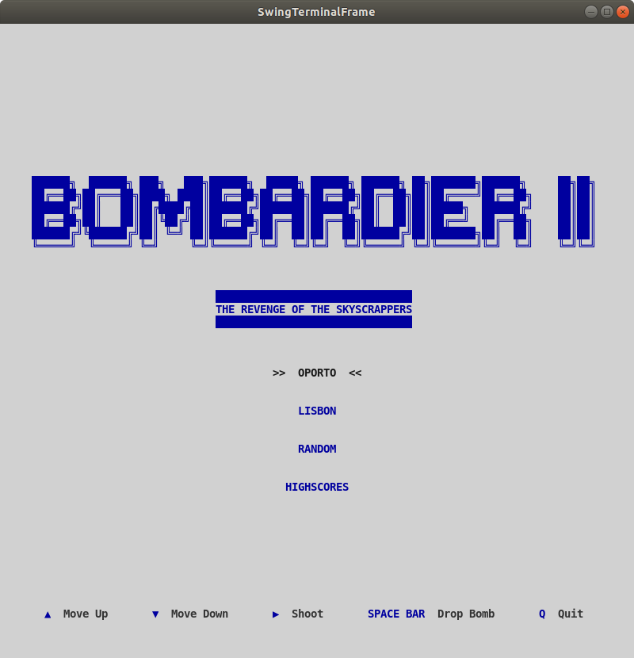
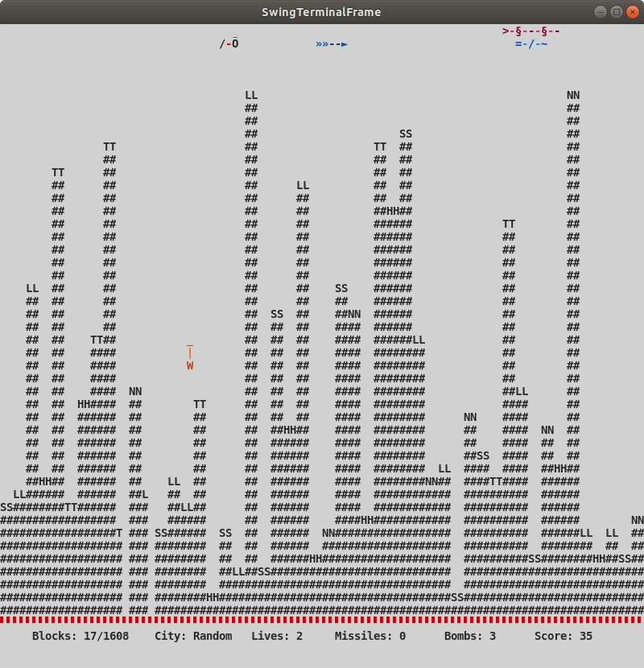

<link href="https://fonts.googleapis.com/css2?family=Roboto+Slab:wght@700&display=swap" rel="stylesheet">

###### [LPOO-2020-G72](https://web.fe.up.pt/~arestivo/page/courses/2020/lpoo/project/)

# Bombardier II : The Revenge of The Skyscrapers

> A suicide helicopter tries to bomb a city taken by the forces of evil, while escaping from monsters moving in its direction.

 | 
------------------------|------------------------

## Description

*This is a more elaborate version of the [Bombardier](https://www.uvlist.net/game-187836-bombardier) game for Linux.*

### There is a helicopter, skyscrapers and some flying monsters!

The helicopter, starting from the top left corner of the scene, will have to destroy the buildings bellow. It may launch some bombs to avoid colliding with them, while losing altitude. At the same time, the monsters will be moving towards it, from the right side. The helicopter will have to launch frontal missiles to defeat them, being able to boost up or down, a little bit, to escape or face the monsters.

----

This project was developed by Diana Freitas ([up201806230@fe.up.pt](mailto:up201806230@fe.up.pt)) and Eduardo Brito ([up201806271@fe.up.pt](mailto:up201806271@fe.up.pt)) for LPOO 2019⁄2020.

## MAIN FEATURES

### Menu
The game starts with the user being able to choose between three scene options (OPorto, Lisbon and Random) or to visualize the High Scores. To select an option he must use the "Up" and "Down" arrows and the "Enter" key to start playing.

### Initial Scene

#### Objects
There is a helicopter placed in the top left corner of the screen, some random generated buildings according to the chosen scene and flying monsters of various forms and colors, depending on the scene.

#### Vertical Movement
The vertical movement of the helicopter is controlled not only by the player, but also by a time factor.
- The player can move the helicopter up or down a little bit, using the arrow keys, to escape the monsters that are flying towards him from the right side.
- The altitude of the helicopter decreases by one unit each time it enters the scene from the left side.
- The monsters randomly change their vertical position by one or two units, as they spot and start to fly towards the helicopter.

#### Horizontal Movement
- The velocity of the helicopter's horizontal movement gives the user time to launch the bombs and shoot the monsters without making it too hard or too easy to finish the game.
- The flying monsters are moving horizontally towards the helicopter, with different animations and wing movements.

### Bomb & Missile Launching
- The right arrow key allows the user to launch a frontal missile.
- Pressing the space key launches a bomb onto the buildings.
- The number of missiles and bombs is limited and, therefore, updated every time the user presses the space or right arrow key. Also, every time the helicopter comes from the left side, this number is recalculated.

### Collision Detection
- If the helicopter collides with a skyscraper, the game ends.
- Colliding with monsters weakens the helicopter, reducing its life.

### Game Messages
The player is presented with a message when a new round begins showing him the current altitude and when ending the game, showing him the final score and a victory/game over message.

### Info Bar
This bar is set on the screen. It is always below the buildings' bottom line and contains the following info, when a new game starts:

#### Blocks
An indication for the number of buildings blocks remaining.

#### City
The city name, chosen in the main menu.

#### Score
This is increased every time the helicopter destroys monsters or buildings.

#### Lives
The Helicopter has a limited number of lives, that decreases every time there is a collision with a monster.

#### Ending
The game ends for three reasons:
- As mentioned before, if the helicopter collides with a building;
- If it loses all the lives, from clashing with monsters;
- Or if every building is successfully put on the ground by its bombs.

### High Scores
The best scores for each scene are stored between game sessions and can be checked by selecting the last option of the menu.

### Restarting
By including a menu, it is always possible to play again choosing another scene or the same one and quickly restart playing.
