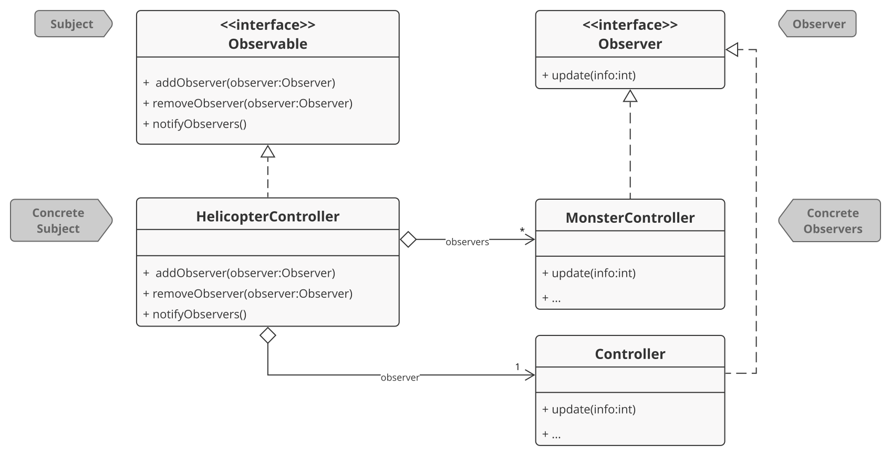

<link href="https://fonts.googleapis.com/css2?family=Roboto+Slab:wght@700&display=swap" rel="stylesheet">

###### [LPOO-2020-G72](https://web.fe.up.pt/~arestivo/page/courses/2020/lpoo/project/)

# Bombardier II : The Revenge of The Skyscrapers

> A suicide helicopter tries to bomb a city taken by the forces of evil, while escaping from monsters moving in its direction.

```java

                                             \-O
                                                                      <-/-{
                                             _
                                             |
               <-(-(                         W
      T                 T                                               T
      # S                #                                           S  #
      # #                #                       R   R  R     R      #  #
      # #                #                       #   #  #    Q#    Q #  #    Q
      # #           P    #                R#     #   #  #    ##    # #  #    #
      # #           #    #   O            ##     #   #  #    ##    # #  #    #
      # #         N #   N#   #        N   ##   N #   #  #    ##    # #  #    # N
      # #         # #   ##   # M      #   ##   # #   #  #    ##    # # M#    # #
 L    # #         # # L ##   # #   L  #   ##   # #   #  # L  ##L   # # ##    # #
 #    # #   K     # # # ##   # #   #  #   ##   # #   #  # #  ###   # # ## K  # #
 # J  # #   #     #J# # ## J # #   #J #J  ##   # #   #  # #  ###   # # ## #  # #
 # #  # #   #     ###I# ## # # #   ## ##  ##   # #   #  # #  ###   # #I## #  # #
 # #  # #   #     ##### ## # # #H  ## ##  ##   # #   #  # #  ###   # #### #  # #
G# #  # #   #   G ##### ## # # ##G ## ##G ##   # #   #  #G#  ###   # #### #  # #
## #  # # F #   #F##### ## #F# ### ## ### ##F  # #  F#  ###  ###   # ####F#FF# #
## #  # # # #  E####### ## ### ### ## ### ###  #E#E ##  ###  ###  E#E######### #
## # D# #D#D#  ######## ## ### ### ## ### ### D#### ##  ###D ###  ############ #
## # ## #####C ######## ## ###C###C## ### ### ##### ##  #### ###C ############ #
##B#B## ######B######## ## ##########B### ### #####B##B #### ####B############ #
####### ###############A##A############## ### ######### #### ################# #
==========Blocks: 0700/0700, City:          OPorto (01), Score:      -1=========
```

## Description

*This is a more elaborate version of the [Bombardier](https://www.uvlist.net/game-187836-bombardier) game for Linux.*

### There will be a helicopter, skyscrapers and some flying monsters!

The helicopter, starting from the top left corner of the scene, will have to destroy the buildings bellow. It may launch some bombs to avoid colliding with them, while losing altitude. At the same time, the monsters will be moving towards it, from the right side. The helicopter will have to launch frontal missiles to defeat them, being able to boost up or down, a little bit, to escape or face the monsters.

----

This project was developed by Diana Freitas ([up201806230@fe.up.pt](mailto:up201806230@fe.up.pt)) and Eduardo Brito ([up201806271@fe.up.pt](up201806271@fe.up.pt)) for LPOO 2019⁄2020.

## IMPLEMENTED FEATURES

### Initial Scene

#### Objects
At this moment, there is a helicopter placed in the top left corner of the screen, some random generated buildings and monsters.

#### Vertical Movement
The vertical movement of the helicopter is controlled not only by the player, but also by a time factor.
- The player can move the helicopter up or down a little bit, using the arrow keys, to escape the monsters that are flying towards him from the right side.
- The altitude of the helicopter decreases by one unit each time it enters the scene from the left side.
- The monsters randomly change their vertical position by one or two units, as they fly towards the helicopter.

#### Horizontal Movement
- The flying monsters are moving horizontally towards the helicopter, possibly with different moving techniques and speeds.

### Info Bar
This bar is already set on the screen. It will always be below the buildings' bottom line and will contain the following info, when a new game starts.

#### Blocks
There will be an indication here for the number of blocks of buildings remaining for destroying.

#### City
The city name, chosen when the main menu is set, will be presented here.

#### Score
The place where the score will be shown.

#### Lives
Not yet configured for the helicopter.

> The above may change as we fully implement new things...

## PLANNED FEATURES

### Initial Scene

#### Objects
There will be a helicopter, placed in the top left corner of the screen, some randomly generated monsters moving towards the helicopter in the top right corner and buildings below them.

### Movement Control and Time Factor

#### Vertical Movement
The vertical movement of the helicopter is controlled not only by the player, but also by a time factor.
- The player can move the helicopter up or down a little bit, using the arrow keys, to escape the monsters that are flying towards him from the right side.
- The altitude of the helicopter decreases by one unit each time it enters the scene from the left side.
- The monsters randomly change their vertical position by one or two units, as they fly towards the helicopter.

#### Horizontal Movement
- The velocity of the helicopter's horizontal movement gives the user time to launch the bombs and shoot the monsters without making it too hard or too easy to finish the game.
- The flying monsters are moving horizontally towards the helicopter, possibly with different moving techniques and speeds.

### Bomb & Missile Launching
- The right arrow key will allow the user to launch a frontal missile.
- Pressing the space key will launch a bomb onto the buildings.
- The number of missiles and bombs should be limited and, therefore, should be updated every time the user presses the space or right arrow key. Also, every time the helicopter comes from the left side, this number should be recalculated.

### Collision Detection
- If the helicopter collides with a skyscraper, the game ends.
- Colliding with monsters weakens the helicopter, reducing its energy.

### Score
The score will be shown on the bottom of the screen. This will be increased every time the helicopter successfully reaches the right side, or when it destroys monsters or buildings.

### Energy
The helicopter has limited energy. This will also be shown on the bottom of the screen and will be reduced every time there is a collision with a monster.

### Game Messages
The player should be presented with a message when starting or ending the game, giving him instructions or showing him the final score.

### Ending
The game ends for three reasons:
- As mentioned before, if the helicopter collides with a building;
- If it loses all the energy, from clashing with monsters;
- Or if every building is successfully put on the ground by its bombs.

### Restarting
It should be possible to restart the game when it ends.

---

## DESIGN

### Bombardier II game components must perform distinct functions 

#### Problem in Context
We felt that it would be crucial from the beginning of our project to delineate the visual, atomic and logical components of our game to assure that we not only followed the Single Responsibility Principle by defining clear responsibilities for each part of our Application, but also that any future change in our game would be easier to implement.

In particular, as our game is still in development, we must be able to add new models (Monsters for example) without changing the View, to add new ways of drawing the elements without changing the Elements themselves and to incrementally implement the rules we defined by only changing the Controller - following the Open/Closed Principle. 

With everything considered, we refactored our code until we were able to clearly distinguish the role of each class. *See here the stages that translate the evolution of this problem and its solution:*

[1. Elements still had visual properties](https://github.com/FEUP-LPOO/lpoo-2020-g72/tree/abcc2a2d1ea733350dedff83da87bca924d5e067/src/src/main/java/com/lpoo/g72)

[2. First Visual Element and subcontroller - scene was not a View nor a Model yet](https://github.com/FEUP-LPOO/lpoo-2020-g72/tree/e24baea0719a3f6ba6b344fbb7f288ffe6532210/src/src/main/java/com/lpoo/g72)

[3. Views had references to the Models](https://github.com/FEUP-LPOO/lpoo-2020-g72/tree/0b27b7c0f997f7f7ec8078d17a86c61aacb35d51/src/src/main/java/com/lpoo/g72)

[4. Controllers, Views and Models defined](https://github.com/FEUP-LPOO/lpoo-2020-g72/tree/86339fee7ecb47b7ddbd6e9778a89eeda95353a7/src/src/test/java/com/lpoo/g72)

#### The Pattern
To divide our Application in parts that perform different tasks we implemented the Model-View-Controller architectural pattern , **MVC Pattern**. This way, we have *Models* that represent the data, the 'atomic' elements of the game such as the Helicopter and the Monsters. Then, we have the *Views* that have the responsibility to draw the elements and interact with the user (Graphical User Interface). Finally, we use multiple *Controllers* to connect the Views and the Models, making sure the game events occur in the desired sequence, determining what should change.

#### Implementation


*For simplification purposes, not all the details about the classes were included in the diagram.*

Mapping the pattern's roles to our classes, we have:
* Model = [Model](../src/src/main/java/com/lpoo/g72/model/Model.java), containing all the game atomic [Elements](../src/src/main/java/com/lpoo/g72/model/element/Element.java), such as the [Helicopter](../src/src/main/java/com/lpoo/g72/model/element/Helicopter.java) and the [Monsters](../src/src/main/java/com/lpoo/g72/model/element/Monster.java), which also represent Models themselves, only containing their *Position*.

* View = [Gui](../src/src/main/java/com/lpoo/g72/gui/Gui.java), which contains two other Views:
  * [VisualHelicopter](../src/src/main/java/com/lpoo/g72/gui/visualElement/VisualHelicopter.java), which is responsible for storing visual information about the Helicopter, such as the color and the form, and to draw it on the screen;
  * [Scene](../src/src/main/java/com/lpoo/g72/gui/Scene.java), which has the ability to draw its buildings in the right way. This also contains a List of Views for the Monsters, [VisualMonsters](../src/src/main/java/com/lpoo/g72/gui/visualElement/VisualMonster.java), because each Scene may have different ways of drawing them.

* Controller = [Controller](../src/src/main/java/com/lpoo/g72/controller/Controller.java) is the main controller of the game, which connects the main View, [Gui](../src/src/main/java/com/lpoo/g72/gui/Gui.java), and the main [Model](../src/src/main/java/com/lpoo/g72/model/Model.java). It gets the input from the user by calling Gui's `getKey()` function in `run()` and redirects it to subcontrollers, the [ElementControllers](../src/src/main/java/com/lpoo/g72/controller/ElementController.java), each one responsible for controlling the behavior of a game *Element* and its correspondent View, [VisualElement](../src/src/main/java/com/lpoo/g72/controller/VisualElement.java):
  * [HelicopterController](../src/src/main/java/com/lpoo/g72/controller/HelicopterController.java), which decides the next movement of the Helicopter based on the key pressed by the user and also considering a time factor.
  * [MonsterController](../src/src/main/java/com/lpoo/g72/controller/MonsterController.java), which controles the movement of a monster.
When all controllers finish, the main controller orders the invoker to execute all the actions that were determined by each controller and orders the [Gui](../src/src/main/java/com/lpoo/g72/gui/Gui.java) to draw itself, redirecting the information about the Models to the View so it can draw them in the right position.
  
##### Consequences

By using the **MVC** architectural Pattern we  came across these advantages: 
- We can have multiple Views for our Models, which will be particularly useful when we want Monsters to look differently while keeping their atomic features. This also means Views can reuse Models, providing reusability of code;
- Any extension we wanted to add to a game class became easier to make because the dependency between classes decreased - *OCP*.
- Testing became easier because, following the *SRP*, smaller classes with one responsibility need fewer tests.

---

### The Scene should be created differently for different Cities

##### Problem in Context
As we've had imagined the possibility to play in different scenes, which, here, represent different cities with their own buildings, monsters, and some other features, we needed to ensure their custom creation every time a new scene was returned. In order to accomplish this, in respect to SRP - in terms of relating the specific purpose of creating a new custom scene to a module only-, we decided to add some SceneCreators. There is, now, a base class, providing us with the necessary abstraction to also ensure the OCP, and its subclasses, each one creating its own detailed/featured city. [See here more of the details on the evolution of this problem and its solution.](https://github.com/FEUP-LPOO/lpoo-2020-g72/commits/master/src/src/main/java/com/lpoo/g72/creator)

##### The Pattern
We have applied the **Factory Method** pattern, which allowed us to represent different SceneCreators, each one returning a different scene, with their own features. Now, we may have tons of different scenes, different cities, random ones, etc.  

##### Implementation


Mapping the pattern's roles to our classes, we have:
* Creator = [SceneCreator](../src/src/main/java/com/lpoo/g72/creator/SceneCreator.java), an abstract class with some methods:
  * AnOperation() = `protected char[][] generateBuildings(int width, int height, Random r, int heightFactor)`
  * FactoryMethod() = `public abstract Scene createScene(int width, int height)`
* ConcreteCreator = [LisbonSceneCreator](../src/src/main/java/com/lpoo/g72/creator/LisbonSceneCreator.java), [OportoSceneCreator](../src/src/main/java/com/lpoo/g72/creator/OportoSceneCreator.java), [RandomSceneCreator](../src/src/main/java/com/lpoo/g72/creator/RandomSceneCreator.java), etc...
  * These, in fact, implement the FactoryMethod from their base class, returning a brand new featured scene.
* Product = [Scene](../src/src/main/java/com/lpoo/g72/scene/Scene.java), as the concrete product built and returned.

##### Consequences
Some benefits of this pattern:
* Firstly, it allowed the SRPrinciple, as the creation of a scene is now the task of only this module. Then, LSP, ISP and specially OCPrinciple followed. The last one is accomplished notoriously because of the simplicity that exists on arranging a new featured scene, with its own characteristics. It only takes creating a new subclass and overriding the `createScene(...)` method.
* It can be particularly interesting when having a main menu or something similar, where the user may choose the next city to attack, or even a random one, from a list of cities that can be drawn on the screen.
* As mentioned, the knowledge of creating a scene is delegated to one of the several subclasses. These, indeed, only depend on one thing to create their predefined, or not, sequence of buildings: a random seed, that will generate the exact sequence of random numbers needed in the `generateBuildings(...)` method. This is the algorithm that "lifts" the cities and fills the array of characters for the scene. That approach reduced the extensive amount of code and allowed a lot of pseudo creativity when creating new scenarios for the game. 

---

### User's keystrokes and elapsed time generate different game actions

##### Problem in Context
Considering the *Model View Controller* architectural pattern, the controllers should be able to request user's input, obtained by the Graphical User Interface, and transform the request into a game action, particularly into the movement of the game elements. 
If the requested movement violates the rules of the game, the controllers should be able to reject a request to move into a specific direction.

Also, some game elements, such as the monsters and the helicopter, should move in a specific direction at a fixed time rate.

Therefore, we concluded that the operations of moving the game elements should be ordered by the controllers after a keystroke or when some time passes, because they are the ones that decide what happens to the gui and to the models according to the game rules. However, controllers can delegate that multiple game Elements should move on each iteration of the game main loop, which means multiple actions on different game Elements will need to be ordered by the Controllers and then executed.

##### The Patterns
To solve this problem we applied both the **Command** and the **Singleton** patterns. 
The **Command** pattern allowed us to parameterize Elements with different actions, by using an interface, [Command](https://github.com/FEUP-LPOO/lpoo-2020-g72/commits/master/src/src/main/java/com/lpoo/g72/commands/Command.java), with a single execution method, `execute()` that is be implemented by multiple classes (Concrete Commands), each performing a specific operation on its *Element* (Receiver), specifically on its *Position*.
Furthermore, to follow the *SRP*, we felt the need to split the responsibility of creating and executing the Commands, which led us to the implementation of a [CommandInvoker](https://github.com/FEUP-LPOO/lpoo-2020-g72/commits/master/src/src/main/java/com/lpoo/g72/commands/CommandInvoker.java).
At this point, implementing the **Singleton** design pattern became a new possibility, because we only needed one CommandInvoker - which works such like a TV remote; to execute all the Commands on each iteration of the game main loop, meaning that we only wanted an instance of the [CommandInvoker](https://github.com/FEUP-LPOO/lpoo-2020-g72/commits/master/src/src/main/java/com/lpoo/g72/commands/CommandInvoker.java) to be used in all classes.
Combining these two design patterns, on each iteration the *ElementControllers* order actions on their respective Elements - by creating Commands and adding them to the Invokers' Command List, `commandInvoker.addCommand(command:Command)`; and then the main Controller, in its `run()` function, asks the [CommandInvoker](https://github.com/FEUP-LPOO/lpoo-2020-g72/commits/master/src/src/main/java/com/lpoo/g72/commands/CommandInvoker.java) to execute all the Commands on its Command List, `commandInvoker.executeCommands()`. 


##### Implementation


*For simplification purposes, details about the classes that take the Client's role in our game - Controllers; are not included in our diagram.*

**Command Pattern** roles can be mapped to the application classes as follows:

* Invoker = [CommandInvoker](../src/src/main/java/com/lpoo/g72/commands/CommandInvoker.java)
  * setCommand(Command command) = `public void addCommand(Command command)`;
  * executeCommand() = `public void executeCommands()`;
* Command = [Command](../src/src/main/java/com/lpoo/g72/commands/Command.java), an interface that contains:
  * execute() = `public void execute()`

* ConcreteCommand = [DirectionalCommand](../src/src/main/java/com/lpoo/g72/commands/directional/DirectionalCommand.java), an abstract class for commands related to directional movements of the elements, which will allows us to create other type of Commands that don't act on Elements for example. It implements **Command** interface and also contains:
  * Receiver = [Element](../src/src/main/java/com/lpoo/g72/scene/element/Element.java)

Concrete Commands that extend the **DirectionalCommand** abstract class and define `public void execute()` from **Command** interface:
* [DownCommand](../src/src/main/java/com/lpoo/g72/commands/directional/DownCommand.java)
* [LeftCommand](../src/src/main/java/com/lpoo/g72/commands/directional/LeftCommand.java)
* [RightCommand](../src/src/main/java/com/lpoo/g72/commands/directional/RightCommand.java)
* [UpCommand](../src/src/main/java/com/lpoo/g72/commands/directional/UpCommand.java)

*All commands can be found on [commands package](../src/src/main/java/com/lpoo/g72/commands)*

**Singleton Pattern** roles can be mapped to the application classes as follows:

* Singleton = [CommandInvoker](../src/src/main/java/com/lpoo/g72/commands/CommandInvoker.java)
  * Singleton() = `private void addCommand(Command command)`, a private constructor;
  * getInstance() = `public static CommandInvoker getInstance()`, a public static creation method for getting the singleton instance;
* Clients = [controllers package](../src/src/main/java/com/lpoo/g72/controller), because all controllers are clients.

##### Consequences
Advantages of using **Command** pattern:

- We could decouple classes that order operations, such as Elements movements, based on user's input and on a time factor - Controllers; from classes that order the execution of the actions - Invoker; from the operations themselves- Commands; and finally from the Element that is transformed - Receiver; which follows the Single Responsibility Principle;
- The controller can interpret the requests and intersect between the request and its execution, depending on the game rules;
- It is now easier to identify the actions and movements performed at any given circumstances because the names of the Commands easily translate what they do.

Advantages of using **Singleton** pattern:
- Ensuring that a single instance of the CommandInvoker is shared by every Controller allows us to add new Commands to its Command List and only ask for the execution of the Commands in the leading Controller.

---

### Monsters should follow the Helicopter

##### Problem in Context
As described before, in Bombardier II, the Helicopter's altitude decreases each new round (every time it enters the screen from the left side). A few moments later, the monsters will move towards the Helicopter from the right side which implies that their altitude and entrance time should also vary in conformity with the Helicopter's movement. We could easily do this by defining both movements (the one from the Helicopter and the one from the Monsters), one on each Controller. However, that would imply that if we decided that the Helicopter's altitude would decrease more/less on each round we would need to modify both Controllers. We wanted both movements to be synchronized in a way that the Monsters would update their *Positions* based on the modifications that occurred with the Helicopter's *Position*.

##### The Pattern
Applying the **Observer** pattern allowed us to obtain the expected outcome, because, by defining the Monsters' Controllers as Observers of the Helicopter Controller (Observable), we can notify them when the altitude decreases and automatically update the Monsters *Position* based on that information.
*The Helicopter's Controller method that calls the method that notifies the Observers*
```java
private void decreaseAltitude(){
  this.element.setPosition(new Position(0, ++this.altitude));
  this.notifyObservers();
}
```

*The Helicopter's Controller method that calls the Monsters' Controllers update method*
```java
public void notifyObservers() {
  for(Observer observer: this.observerList)
      observer.update(this.altitude);
}
```

##### Implementation

 

* Subject = [Observable](../src/src/main/java/com/lpoo/g72/controller/Observable.java), an interface with the following methods:
  * attach(Observer) = `public void addObserver(Observer observer)`;
  * detach(Observer) = `public void removeObserver(Observer observer)`;
  * notify() = `public void notifyObservers()`.

* ConcreteSubject = [HelicopterController](../src/src/main/java/com/lpoo/g72/controller/HelicopterController.java), which implements the previous interface and defines its methods:
  * attach(Observer) = `public void addObserver(Observer observer)`, in which the new Observer is added to a list of Observers;
  * detach(Observer) = `public void removeObserver(Observer observer)`, to remove an Observer from the list;
  * notify() = `public void notifyObservers()`, which is used to indicate an altitude change, by calling the update function of all its Observers.

* Observer = [Observer](../src/src/main/java/com/lpoo/g72/controller/Observer.java), an interface with the following methods:
  * update() = `public void update(int info)`.

* ConcreteObserver = [MonsterController](../src/src/main/java/com/lpoo/g72/controller/MonsterController.java), which implements the previous interface and defines its methods:
  * update() = `public void update(int info)`, in which the altitude of the Monster is calculated based on `info`

##### Consequences
Some advantages of this pattern:
* We obey the OCP by the fact that we can introduce new subscriber classes without having to change the publisher’s code (and vice versa if there’s a publisher interface). In our case, new types of monsters may also be observers of the helicopter, at any time, with almost no effort.
* The relations are established at runtime, not influencing the initial or final state of the game.
* The dependency defined is a one-to-many, so the observers are automatically notified and updated at the same time, whenever needed.
* Loosely coupled objects are flexible with changing requirements, because the interacting objects have less information about each other. The monsters only need to know the helicopter altitude to move towards him.

### Different game sections should be shown according to the state of the game

##### Problem in Context
Given the fact that the user should be able to choose between a couple of different game scenes, we decided to implement a menu that enables this interaction with the user. Also, at any time the user must have the possibility to go back and choose a different scene or even to quit the game. Furthermore, when the user wins or loses, a message should be shown on the screen to let him know the score he achieved. At this point, if the user wants to quit, we want to encourage him to try again by showing him the menu.

##### The Pattern
Applying the **State** pattern allowed us to achieve different game behaviors according to the state of the game and to establish connections between the states. In particular, we defined that, initially, a menu should be shown, *Menu State*, while the user is deciding the game scene or until he quits de game. When the scene is picked, the game elements and visual features are set accordingly, switching the state of the Controller to *Game State*. During this state, if the user performs an action to quit the game, we take him back to the *Menu State*. Otherwise, the game state will only be changed if the user wins or loses the game. *End Game State* is set in this case, where, once more, pressing 'Q' will take the user back to the menu.

##### Implementation
 

// TODO - state machine diagram

* State = [State](../src/src/main/java/com/lpoo/g72/controller/states/State.java), an asbtract class that stores a protected reference to the context object and which declares the following abstract method:
  * handle() = `public abstract void action(Gui.key key)`, the state-specific method.

Concrete States that extend the **State** abstract class and define `public void action(Gui.Key key)` state-specific method, calling Context methods to perform their actions:
* [MenuState](../src/src/main/java/com/lpoo/g72/controller/states/MenuState.java), which calls Controller's 'public void menu(Gui.Key key)';
* [GameState](../src/src/main/java/com/lpoo/g72/controller/states/GameState.java), which calls Controller's 'public void play(Gui.Key key)';
* [EndGame](../src/src/main/java/com/lpoo/g72/controller/states/EndGame.java), which calls Controller's 'public void endGame(Gui.Key key)';

*All states can be found on [states package](../src/src/main/java/com/lpoo/g72/controller/states)*

* Context = [Controller](../src/src/main/java/com/lpoo/g72/controller/Controller.java), which stores a reference to a concrete state object and delegates to it all state-specific work. It also defines some methods that are called by each Concrete State to change the interface according to the state and where state changes are sometimes performed as well:
  * `public void menu(Gui.Key key)`, where the menu is drawn until a scene is chosen by the user;
  * `public void play(Gui.Key key)`, where the actual game actions take place, according to the user actions and to a time factor;
  * `public void endGame(Gui.Key key)`, where a victory or game over message is shown;

Furthermore, the Context includes a method that requests the action from the active State:
  * request() = `public void run()`.

##### Consequences
Some advantages of this pattern:
* By separating the code related to a particular state into a separate class (Concrete State) we follow the Single Responsibility Principle.
* It is possible to add new states without changing existing state classes or the context, which meets the Open/Closed Principle.
* State Machine conditionals are dismissed, which simplifies Controller's methods.


## KNOWN CODE SMELLS AND REFACTORING SUGGESTIONS

### Switch Statement && Conditionals

// TODO - explain why the switch statement in Controller's initModel() and menu() and in Gui's getKey() are not a problem.

### Data Class

The models of the game, in particular the game elements - *Monster* and *Helicopter*, come across as **data classes** which only contain their fields - *Position*, and its accessors. However, considering the *MVC* architectural pattern, we don't feel that this code smell represents a problem in our code because Models must not know how to draw themselves nor how to behave. 

### Middle Man

Following the previous problem, the *Element* hierarchy performs, in fact, only one (set of) action(s), delegating work to another class, the *Position*. This is also intentional, because, as the game grows, its elements will start to acquire more inner characteristics (lives, energy, etc... ), as planned.

### Duplicate Code

There is, indeed, some identical code found, for example, in two subclasses of the same level, the *HelicopterController* and the *MonsterController*. At this point, part of this duplication can be purposeful, by the fact that it may be more obvious to leave them as they are now, if, in the future, we need to give them different behavior. If this does not prevail, then *Pull Up Constructor Body*, *Extract Method*, or *Form Template Method* will be used for refactoring this problem. The same happens with the *SceneCreator* hierarchy, where there are also methods filled with explanatory **comments**, due mostly to the necessity of explaining the algorithm for generating the buildings (when all other methods for simplifying the algorithm have been tried and came up short).


## TESTING


## SELF-EVALUATION

- Diana Freitas: 50%

- Eduardo Brito: 50%

<!-- MORE INFO AT https://web.fe.up.pt/~arestivo/page/courses/2020/lpoo/template/ -->
