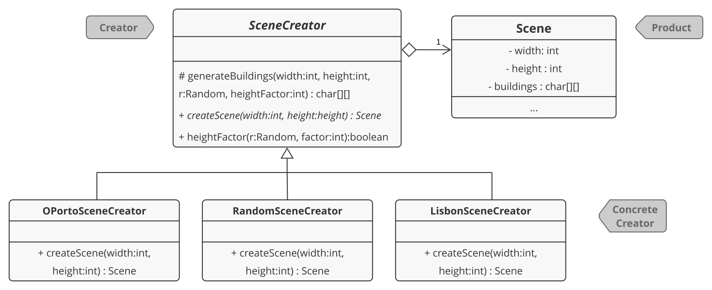
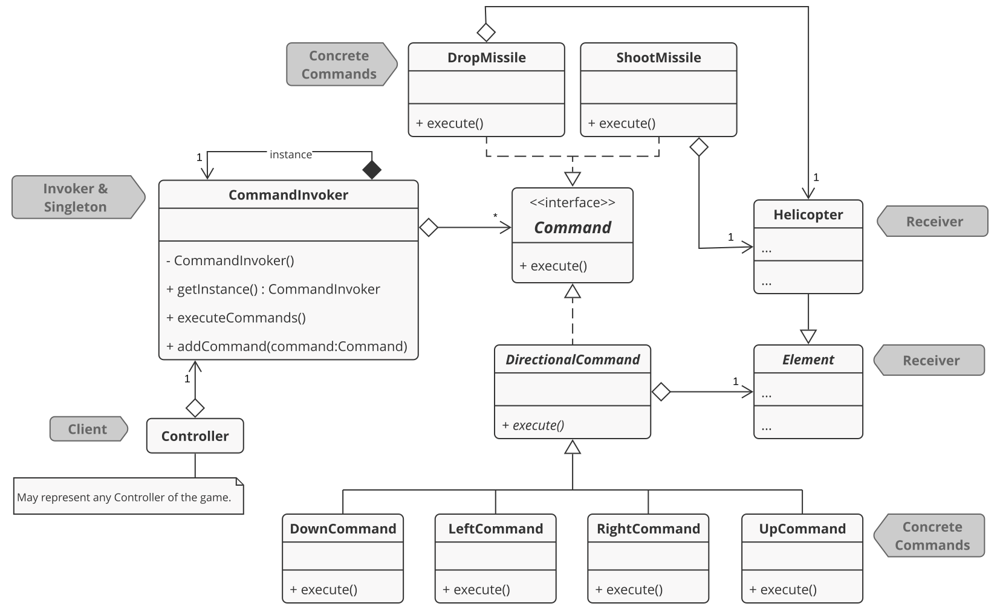

<link href="https://fonts.googleapis.com/css2?family=Roboto+Slab:wght@700&display=swap" rel="stylesheet">

###### [LPOO-2020-G72](https://web.fe.up.pt/~arestivo/page/courses/2020/lpoo/project/)

# Bombardier II : The Revenge of The Skyscrapers

> A suicide helicopter tries to bomb a city taken by the forces of evil, while escaping from monsters moving in its direction.

```java

                                             \-O
                                                                      <-/-{
                                             _
                                             |
               <-(-(                         W
      T                 T                                               T
      # S                #                                           S  #
      # #                #                       R   R  R     R      #  #
      # #                #                       #   #  #    Q#    Q #  #    Q
      # #           P    #                R#     #   #  #    ##    # #  #    #
      # #           #    #   O            ##     #   #  #    ##    # #  #    #
      # #         N #   N#   #        N   ##   N #   #  #    ##    # #  #    # N
      # #         # #   ##   # M      #   ##   # #   #  #    ##    # # M#    # #
 L    # #         # # L ##   # #   L  #   ##   # #   #  # L  ##L   # # ##    # #
 #    # #   K     # # # ##   # #   #  #   ##   # #   #  # #  ###   # # ## K  # #
 # J  # #   #     #J# # ## J # #   #J #J  ##   # #   #  # #  ###   # # ## #  # #
 # #  # #   #     ###I# ## # # #   ## ##  ##   # #   #  # #  ###   # #I## #  # #
 # #  # #   #     ##### ## # # #H  ## ##  ##   # #   #  # #  ###   # #### #  # #
G# #  # #   #   G ##### ## # # ##G ## ##G ##   # #   #  #G#  ###   # #### #  # #
## #  # # F #   #F##### ## #F# ### ## ### ##F  # #  F#  ###  ###   # ####F#FF# #
## #  # # # #  E####### ## ### ### ## ### ###  #E#E ##  ###  ###  E#E######### #
## # D# #D#D#  ######## ## ### ### ## ### ### D#### ##  ###D ###  ############ #
## # ## #####C ######## ## ###C###C## ### ### ##### ##  #### ###C ############ #
##B#B## ######B######## ## ##########B### ### #####B##B #### ####B############ #
####### ###############A##A############## ### ######### #### ################# #
==========Blocks: 0700/0700, City:          OPorto (01), Score:      -1=========
```

## Description

*This is a more elaborate version of the [Bombardier](https://www.uvlist.net/game-187836-bombardier) game for Linux.*

### There will be a helicopter, skyscrapers and some flying monsters!

The helicopter, starting from the top left corner of the scene, will have to destroy the buildings bellow. It may launch some bombs to avoid colliding with them, while losing altitude. At the same time, the monsters will be moving towards it, from the right side. The helicopter will have to launch frontal missiles to defeat them, being able to boost up or down, a little bit, to escape or face the monsters.

----

This project was developed by Diana Freitas ([up201806230@fe.up.pt](mailto:up201806230@fe.up.pt)) and Eduardo Brito ([up201806271@fe.up.pt](up201806271@fe.up.pt)) for LPOO 2019⁄2020.

## IMPLEMENTED FEATURES

### Initial Scene

#### Objects
At this moment, there is a helicopter placed in the top left corner of the screen and some random generated buildings. Monsters are yet to come.

### Info Bar
This bar is already set on the screen. It will always be below the buildings' bottom line and will contain the following info, when a new game starts.

#### Blocks
There will be an indication here for the number of blocks of buildings remaining for destroying.

#### City
The city name, chosen when the main menu is set, will be presented here.

#### Score
The place where the score will be shown.

#### Lives
Not yet configured for the helicopter.

> The above may change as we fully implement new things...

## PLANNED FEATURES

### Initial Scene

#### Objects
There will be a helicopter, placed in the top left corner of the screen, some randomly generated monsters moving towards the helicopter in the top right corner and buildings below them.

### Movement Control and Time Factor

#### Vertical Movement
The vertical movement of the helicopter is controlled not only by the player, but also by a time factor.
- The player can move the helicopter up or down a little bit, using the arrow keys, to escape the monsters that are flying towards him from the right side.
- The altitude of the helicopter decreases by one unit each time it enters the scene from the left side.
- The monsters randomly change their vertical position by one or two units, as they fly towards the helicopter.

#### Horizontal Movement
- The velocity of the helicopter's horizontal movement gives the user time to launch the bombs and shoot the monsters without making it too hard or too easy to finish the game.
- The flying monsters are moving horizontally towards the helicopter, possibly with different moving techniques and speeds.

### Bomb & Missile Launching
- The right arrow key will allow the user to launch a frontal missile.
- Pressing the space key will launch a bomb onto the buildings.
- The number of missiles and bombs should be limited and, therefore, should be updated every time the user presses the space or right arrow key. Also, every time the helicopter comes from the left side, this number should be recalculated.

### Collision Detection
- If the helicopter collides with a skyscraper, the game ends.
- Colliding with monsters weakens the helicopter, reducing its energy.

### Score
The score will be shown on the bottom of the screen. This will be increased every time the helicopter successfully reaches the right side, or when it destroys monsters or buildings.

### Energy
The helicopter has limited energy. This will also be shown on the bottom of the screen and will be reduced every time there is a collision with a monster.

### Game Messages
The player should be presented with a message when starting or ending the game, giving him instructions or showing him the final score.

### Ending
The game ends for three reasons:
- As mentioned before, if the helicopter collides with a building;
- If it loses all the energy, from clashing with monsters;
- Or if every building is successfully put on the ground by its bombs.

### Restarting
It should be possible to restart the game when it ends.

## DESIGN

### The Scene should be created differently for different Cities

##### Problem in Context
As we've had imagined the possibility to play in different scenes, which, here, represent different cities with their own buildings, monsters, and some other features, we needed to ensure their custom creation every time a new scene was returned. In order to accomplish this, in respect to SRP - in terms of relating the specific purpose of creating a new custom scene to a module only-, we decided to add some SceneCreators. There is, now, a base class, providing us with the necessary abstraction to also ensure the OCP, and its subclasses, each one creating its own detailed/featured city. [See here more of the details on the evolution of this problem and its solution.](https://github.com/FEUP-LPOO/lpoo-2020-g72/commits/master/src/src/main/java/com/lpoo/g72/creator)

##### The Pattern
We have applied the **Factory Method** pattern, which allowed us to represent different SceneCreators, each one returning a different scene, with their own features. Now, we may have tons of different scenes, different cities, random ones, etc.  

##### Implementation



Mapping the pattern's roles to our classes, we have:
* Creator = [SceneCreator](../src/src/main/java/com/lpoo/g72/creator/SceneCreator.java), an abstract class with some methods:
  * AnOperation() = `protected char[][] generateBuildings(int width, int height, Random r, int heightFactor)`
  * FactoryMethod() = `public abstract Scene createScene(int width, int height)`
* ConcreteCreator = [LisbonSceneCreator](../src/src/main/java/com/lpoo/g72/creator/LisbonSceneCreator.java), [OportoSceneCreator](../src/src/main/java/com/lpoo/g72/creator/OportoSceneCreator.java), [RandomSceneCreator](../src/src/main/java/com/lpoo/g72/creator/RandomSceneCreator.java), etc...
  * These, in fact, implement the FactoryMethod from their base class, returning a brand new featured scene.
* Product = [Scene](../src/src/main/java/com/lpoo/g72/scene/Scene.java), as the concrete product built and returned.

##### Consequences
Some benefits of this pattern:
* Firstly, it allowed the SRPrinciple, as the creation of a scene is now the task of only this module. Then, LSP, ISP and specially OCPrinciple followed. The last one is accomplished notoriously because of the simplicity that exists on arranging a new featured scene, with its own characteristics. It only takes creating a new subclasse and overriding the `createScene(...)` method.
* It can be particularly interesting when having a main menu or something similar, where the user may choose the next city to attack, or even a random one, from a list of cities that can be drawn on the screen.
* As mentioned, the knowledge of creating a scene is delegated to one of the several subclasses. These, indeed, only depend on one thing to create their predefined, or not, sequence of buildings: a random seed, that will generate the exact sequence of random numbers needed in the `generateBuildings(...)` method. This is the algorithm that "lifts" the cities and fills the array of characters for the scene. That approach reduced the extensive amount of code and allowed a lot of pseudo creativity when creating new scenarios for the game. 

### User's keystrokes and elapsed time generate different game actions

##### Problem in Context
Considering the Model View Controller architectural pattern, the Scene Controller should be able to request user's input, obtained by the User Interface, and transform the request into a game action, particularly into a helicopter movement. 
If the requested movement violates the rules of the game, the Scene Controller should be able to reject a request to move into a specific direction.

Also, some game elements, such as the monsters and the helicopter, should move in a specific direction at a fixed time rate.

Therefore, we concluded that the operations themselves of moving a game element, for example, should be invoked by the Scene Controller after a keystroke or when some time passes, because he is the one that decides what happens in the scene according to the game rules, however he doesn't need to perform them, delegating the operations to the Commands themselves.

##### The Pattern
The **Command** pattern was applied. This pattern lets you parameterize objects with different actions and support undoable operations, by using an interface with a single execution method that is implemented by multiple classes, each performing a specific operation on an Object (receiver) which they must contain the reference to.

##### Implementation




He implemented the **Command Pattern** with some variations because, in our case, we want the Invoker - Scene Controller; to create the Commands himself rather than receiving them from a Client. Otherwise, we would be assigning the responsibility to create the Command to the View, which must not own this ability.  

Considering this variation, we can map the pattern's roles to our classes:

##### Invokers (and also Clients in this case): 
Any [controller](../src/src/main/java/com/lpoo/g72/controller) can create and invoke Commands. Some of the controllers that invoke Commands:
* [SceneController](../src/src/main/java/com/lpoo/g72/controller/SceneController.java), using `public void run ()`
* [HelicopterController](../src/src/main/java/com/lpoo/g72/controller/HelicopterController.java), using `public void executeCommand(Key key)`
* [MonsterController](../src/src/main/java/com/lpoo/g72/controller/MonsterController.java), using `public void move()`
Which build and invoke the commands based on:
- the key received from the keyboard;
- the game rules - which determine if the requested operation is doable;
- a time factor - only performing the command at a fixed time rate.

##### Command: 
* [Command](../src/src/main/java/com/lpoo/g72/commands/Command.java), an interface that contains:
  * execute() = `public void execute()`

##### Concrete Commands:
*All commands can be found on [commands package](../src/src/main/java/com/lpoo/g72/commands)*
* [DirectionalCommand](../src/src/main/java/com/lpoo/g72/commands/directional/DirectionalCommand.java), an abstract class for commands related to directional movements of the elements. It implements **Command** interface and also contains:
  * receiver = [Element](../src/src/main/java/com/lpoo/g72/scene/element/Element.java)

Directional Commands that extend the **DirectionalCommand** abstract class and define `public void execute()` from **Command** interface:
* [DownCommand](../src/src/main/java/com/lpoo/g72/commands/directional/DownCommand.java)
* [LeftCommand](../src/src/main/java/com/lpoo/g72/commands/directional/LeftCommand.java)
* [RightCommand](../src/src/main/java/com/lpoo/g72/commands/directional/RightCommand.java)
* [UpCommand](../src/src/main/java/com/lpoo/g72/commands/directional/UpCommand.java)

*All directional command can be found on [directional package](../src/src/main/java/com/lpoo/g72/commands/directional)*

* [NullCommand](../src/src/main/java/com/lpoo/g72/commands/NullCommand.java), which implements **Command** interface
* [QuitCommand](../src/src/main/java/com/lpoo/g72/commands/QuitCommand.java), which implements **Command** interface and also contains:
  * receiver = TerminalScreen screen

##### Consequences
Advantages of using **Command** pattern:

- We could decouple classes that invoke operations such as movements and game actions (Controllers) from classes that perform these operations (Commands), which follows the Single Responsibility Principle;
- The controller can interpret the requests and intersect between the request and its execution, depending on the game rules;
- It is now easier to identify the actions and movements performed at any given circunstances because the names of the Commands easily translate what they do.

Disadvantages of using **Command** pattern:

- Since the controllers must sometimes translate a Key into a Command, in order to execute one Command it first needs to create it. This implies that, if a new action is introduced in the Game, we need to create a new Command to perform that action and include another if statement in the respective Controller function that creates/invokes the new Command depending on the game event. However, having attentively examined all aspects, we consider that, for now at least, this solution fits our problems.


## KNOWN CODE SMELLS AND REFACTORING SUGGESTIONS

## SELF-EVALUATION

<!-- MORE INFO AT https://web.fe.up.pt/~arestivo/page/courses/2020/lpoo/template/ -->
